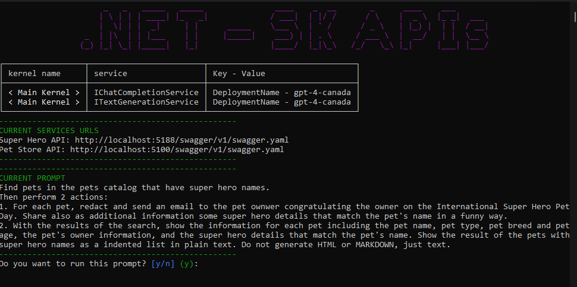

# Semantic Kernel API Manifest Plugins - Sample

[](/LICENSE)
[](https://twitter.com/elbruno)


_Learn how to add plugins from API Manifest to Semantic Kernel in minutes._ ✨

This is a quickstart to add plugins to a Semantic Kernel kernel directly from an API Manifest. 

## TL;DR

**API Manifest Plugins** for Semantic Kernel allows developers to efficiently import plugins from OpenAPI documents. It addresses the challenge of importing large API descriptions, like Microsoft Graph, by packaging subsets of APIs together. The API Manifest is a document detailing an application's API dependencies, including links to API descriptions, requests made by the application, and their authorization requirements.

The page also outlines a scenario where these plugins are utilized to create consistent Markdown and HTML tables from email content, using the GitHub API for consistent HTML output. It highlights the flexibility of Semantic Kernel's plugin infrastructure and invites feedback and contributions from developers on the Semantic Kernel GitHub Discussion Channel. **Engagement with the community** and **future enhancements** like automated API Manifest file generation are also mentioned.

More information [Introducing API Manifest Plugins for Semantic Kernel](https://devblogs.microsoft.com/semantic-kernel/introducing-api-manifest-plugins-for-semantic-kernel-2/?WT.mc_id=academic-00000-brunocapuano)

## Prerequisites

Before running this project, make sure you have the following prerequisites:

- [.NET 8](https://dotnet.microsoft.com/download/dotnet/8.0)
- [Visual Studio 2022](https://visualstudio.microsoft.com) or [Visual Studio Code](https://code.visualstudio.com/)
- Access to OpenAI APIs or (Azure OpenAI Services)[https://learn.microsoft.com/en-us/azure/ai-services/openai/overview?WT.mc_id=academic-00000-brunocapuano]

### Optional for the Aspire demo
- [.NET Aspire Prerequisites](https://learn.microsoft.com/en-us/dotnet/aspire/get-started/build-your-first-aspire-app?tabs=visual-studio#prerequisites)

## Azure OpenAI Keys

The `sktestAPIs` project uses **.NET User Secrets** to store the Azure OpenAI credentials. In the next steps, we will share the commands to set these secrets.

```bash
dotnet user-secrets init

dotnet user-secrets set "AZURE_OPENAI_MODEL-GPT4" "... deployment name ..."
dotnet user-secrets set "AZURE_OPENAI_ENDPOINT" "... endpoint ..."
dotnet user-secrets set "AZURE_OPENAI_APIKEY" "... api key ..."
```

## SK Tests External Services

The `sktestAPIs` adds plugins to the kernel directly from an API manifest definition. This is the current API manifest used in the project:

```json
{
  "applicationName": "SKs Labs",
  "description": "SKs Labs",
  "publisher": {
    "name": "Bruno Capuano",
    "contactEmail": "bruno@elbruno.com"
  },
  "apiDependencies": {
    "superheroapi": {
      "apiDescriptionUrl": "http://localhost:5188/swagger/v1/swagger.yaml",
      "apiDeploymentBaseUrl": "http://localhost:5188/",
      "requests": [
        {
          "method": "GET",
          "uriTemplate": "/GetAllHeroes"
        }
      ]
    },
    "petssearch": {
      "apiDescriptionUrl": "http://localhost:5100/swagger/v1/swagger.yaml",
      "apiDeploymentBaseUrl": "http://localhost:5100/",
      "requests": [
        {
          "method": "GET",
          "uriTemplate": "/GetAllPets"
        }
      ]
    }
  }
}
```
The previous 2 services will help the kernel with the Pets and Super Heroes information. In order to send emails, the kernel add a plugin that emulates a email sender.

```csharp
// Create a chat completion service
var builder = Kernel.CreateBuilder();
builder.AddAzureOpenAIChatCompletion(deploymentName, endpoint, apiKey);
builder.Plugins.AddFromType<EmailPlugin>();
Kernel kernel = builder.Build();
```

The email plugin, will display a table with the email information when is called at runtime from the planner.

## Run

Before running the `sktestAPIs` project, make sure that the `PetStoreAPI` and `superheroesapi` projects are running. These APIs provide the necessary data for the `sktestAPIs` project to function properly. 

To start the `PetStoreAPI` and `superheroesapi` projects, run them from the Visual Studio 2002 or Visual Studio Code. You can also run them with the following commands:

```bash
# build and run the API projects
dotnet run src/PetStoreAPI/
dotnet run src/PetStoreAPI/

# build and run the main project
dotnet run src/sk-testAPIs/
```

Once the API projects are running, you can launch the `sktestAPIs` project by executing the previous commands.

## Demo Steps

The main goal of the project is to use the **Pet Store API**, the **Super Hero API** and the **EMail Plugin** to solve this goal:

    Find pets in the pets catalog that have super hero names.
    Then perform 2 actions:

    1. For each pet, redact and send an email to the pet ownwer congratulating the owner on the International Super Hero Pet
    Day. Share also as additional information some super hero details that match the pet's name in a funny way.

    2. With the results of the search, show the information for each pet including the pet name, pet type, pet breed and pet
    age, the pet's owner information, and the super hero details that match the pet's name. Show the result of the pets with
    super hero names as a indented list in plain text. Do not generate HTML or MARKDOWN, just text.

Once the console demo starts, the user will be notified with the kernel information, the plugins location, and the goal to solve. The user must accept to continue. When the user accepts, the process will be launched, and after a while, it will show the emails sent and the list of pets with superhero names.




## Author

👤 **Bruno Capuano**

* Website: https://elbruno.com
* Twitter: [@elbruno](https://twitter.com/elbruno)
* Github: [@elbruno](https://github.com/elbruno)
* LinkedIn: [@elbruno](https://linkedin.com/in/elbruno)

## 🤝 Contributing

Contributions, issues and feature requests are welcome!

Feel free to check [issues page](https://github.com/elbruno/sk-API-Manifest-Plugins/issues).

## Show your support

Give a ⭐️ if this project helped you!


## 📝 License

Copyright &copy; 2023 [Bruno Capuano](https://github.com/elbruno).

This project is [MIT](/LICENSE) licensed.

***